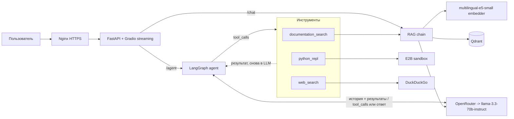
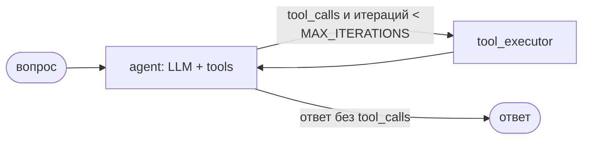

# scikit-learn docs assistant: RAG + agent

AI-ассистент по официальной документации scikit-learn. Задаёте вопрос
на естественном языке (английском или русском) — получаете ответ с цитатами из документации.

Два режима:

- **Быстрый (`/chat`)** — классический RAG: один поиск по документации и один вызов LLM, ответ за 4–7 секунд.
- **Агент (`/agent`)** — ReAct-агент на LangGraph: сам решает, искать ли в документации, посчитать в Python
  или поискать в интернете, и может выстроить цепочку из нескольких инструментов. Отвечает дольше (7–18 секунд),
  зато справляется с вопросами вида «найди значение по умолчанию и посчитай с ним формулу».

Живой сервис: https://agent.130-49-143-10.nip.io (Swagger: [/docs](https://agent.130-49-143-10.nip.io/docs)).
Предыдущая версия без агента (только RAG) работает на https://130-49-143-10.nip.io.

## Архитектура



## Агент

Граф из двух узлов: `agent` вызывает LLM с привязанными инструментами, `tool_executor` исполняет
запрошенные вызовы и возвращает результат обратно в `agent`. Цикл продолжается, пока LLM запрашивает
инструменты, но не дольше `MAX_ITERATIONS` (по умолчанию 5) итераций.



| Инструмент | Что делает | Когда агент его выбирает |
|---|---|---|
| `documentation_search` | Тот же RAG, что и `/chat`: ответ по корпусу + блок `Sources:` с URL | Вопросы про классы, параметры и понятия scikit-learn |
| `python_repl` | Выполняет Python-код в одноразовой микро-VM [E2B](https://e2b.dev) без доступа в интернет | Арифметика, формулы, преобразование данных |
| `web_search` | Поиск DuckDuckGo; отключается `ENABLE_WEB_SEARCH=false` | Свежие данные: последние версии, релизы, новости |

**Безопасность.** Код для `python_repl` пишет LLM, поэтому его может подсказать пользователь или
веб-страница (prompt injection). Код выполняется не в процессе сервиса, а в изолированной VM E2B: к файлам,
переменным окружения и сети сервера у него доступа нет, а VM уничтожается после каждого вызова.
Без `E2B_API_KEY` инструмент отключён.

**Guardrails.** На входе `check_input` отклоняет слишком длинные вопросы, посторонние символы и типовые
фразы prompt injection. На выходе `check_output` обрезает слишком длинный ответ и заменяет отказом ответ,
который ссылается на документацию, хотя агент не вызывал `documentation_search`.

**Наблюдаемость.** В Gradio в режиме «Агент» строка статуса показывает текущий шаг («📚 Ищу в документации…»,
«🧮 Считаю в Python REPL…»), а блок «Что сделал агент» — все вызовы инструментов с аргументами.
REST-ответ `/agent` содержит те же шаги в поле `trace`. Каждая итерация логируется в JSON через structlog
(задержка, число и имена запрошенных инструментов, без текста вопроса).

### Пример запроса

```bash
curl -X POST http://localhost:8002/agent \
  -H "Content-Type: application/json" \
  -d '{"question": "What is the default alpha in Ridge? Then compute alpha * 10 with python_repl."}'
```

```json
{
  "answer": "The default alpha in Ridge regression is 1.0. The result of alpha * 10 is 10.0 ...",
  "trace": [
    {"step": 1, "node": "agent", "tool": "documentation_search", "input": {"query": "..."}, "output": "..."},
    {"step": 2, "node": "agent", "tool": "python_repl", "input": {"code": "print(1.0 * 10)"}, "output": "10.0"}
  ],
  "sources": [{"url": "https://scikit-learn.org/stable/modules/linear_model.html#...", "snippet": "..."}],
  "guardrail_triggered": null,
  "iterations": 3
}
```

Чтобы продолжить диалог, передайте тот же `thread_id` в следующем запросе. История хранится в памяти
процесса (`MemorySaver`) и теряется при перезапуске.

Для ручной проверки без HTTP есть CLI: `python -m app.agent.runner "What is Ridge regression?"`.

## Метрики

### RAG

Замеры на реальной системе (10 вопросов golden dataset: 7 EN, 2 RU, 1 мета-вопрос;
3 sklearn-модуля + about.md → 265 чанков, llama-3.3-70b-instruct,
[`notebooks/rag_eval.ipynb`](notebooks/rag_eval.ipynb)):

| Метрика | Значение | Что измеряет |
|---|---|---|
| Recall@4 | **1.00** | retriever возвращает URL из нужного раздела документации во всех 10 случаях |
| Faithfulness | **0.86** | LLM-судья: ответ не противоречит контексту |
| Response Relevancy | **0.94** | LLM-судья: ответ по делу, не уходит в сторону |

Судья RAGAS — та же llama-3.3-70b-instruct. Recall@4 считается по совпадению раздела
(`linear_model` / `tree` / `model_evaluation`) в URL источника, а не конкретного фрагмента.
Итоговые значения: [`notebooks/rag_metrics.json`](notebooks/rag_metrics.json).

### Эксперимент: reranker

Между retriever'ом и сборкой контекста добавлен cross-encoder `cross-encoder/ms-marco-MiniLM-L-6-v2`:
retriever достаёт top-20 чанков, cross-encoder заново оценивает каждую пару «вопрос — чанк»,
и в контекст LLM попадают 5 лучших.

| Метрика | Без reranker (top-4) | С reranker (top-20 → top-5) | Δ |
|---|---|---|---|
| Recall | 1.00 | 1.00 | 0 |
| Faithfulness | 0.86 | **0.90** | +0.04 |
| Response Relevancy | 0.94 | 0.94 | 0 |

- **Faithfulness выросла на 0.04**: с переоценённым контекстом ответы чуть точнее опираются на источники.
- **Response Relevancy и Recall не изменились.** Recall и без reranker'а был 1.00.
- **Цена**: ещё одна модель в памяти (~90 МБ весов) и 20 пар на прогон cross-encoder'ом при каждом запросе.

Включить: `RERANK_ENABLED=true` в `.env`. Параметры: `RERANK_MODEL`, `RERANK_FETCH_K` (по умолчанию 20),
`RERANK_TOP_N` (по умолчанию 5). Результаты: [`notebooks/rag_metrics_rerank.json`](notebooks/rag_metrics_rerank.json).

### Агент vs RAG

15 вопросов: те же 10 из golden dataset + 5 multi-hop, которым нужны два инструмента подряд
(например, найти значение в документации и посчитать с ним формулу).
Оба режима — llama-3.3-70b-instruct, судья RAGAS — та же модель,
[`notebooks/agent_eval.ipynb`](notebooks/agent_eval.ipynb):

| Метрика | RAG (`/chat`) | Агент (`/agent`) |
|---|---|---|
| Faithfulness (все 15) | 0.81 | 0.82 |
| Response Relevancy (все 15) | 0.81 | **0.87** |
| Точность выбора инструментов (5 multi-hop) | — | 40% |
| Итераций LLM на вопрос, в среднем | 1 | 2.1 |
| Время ответа (3 вопроса, прогретый сервис) | 3.6–6.8 с | 7–18 с |

- **Response Relevancy выросла на 0.06** за счёт multi-hop вопросов: RAG находит только половину ответа
  и ничего не считает, агент доводит цепочку до результата.
- **Точность выбора инструментов — 40%** (2 из 5): Llama 3.3 иногда пропускает второй инструмент
  или повторяет поиск. Разбор причин и путей исправления — в [`LIMITATIONS.md`](LIMITATIONS.md#7-зависимость-от-промпта-и-модели).
- **Цена**: в 2–5 раз больше времени и LLM-вызовов на вопрос.

Итоговые значения: [`notebooks/baseline_metrics.json`](notebooks/baseline_metrics.json),
[`notebooks/agent_metrics.json`](notebooks/agent_metrics.json), [`notebooks/comparison.md`](notebooks/comparison.md).

## Локальный запуск

Нужен ключ OpenRouter (или любого OpenAI-совместимого провайдера). Ключ [E2B](https://e2b.dev)
нужен только для `python_repl`; без него агент работает с двумя остальными инструментами.

```bash
cat > .env <<'EOF'
LLM_API_KEY=<ключ OpenRouter>
E2B_API_KEY=<ключ E2B>
QDRANT_URL=http://localhost:6334
EOF
python -m venv venv && source venv/bin/activate
pip install -r requirements.txt

# 1. Qdrant
docker compose up -d qdrant

# 2. Корпус и индекс
python -m app.scripts.load_corpus
python -m app.scripts.index_corpus

# 3. Сервис
docker compose up -d app
```

Откройте http://localhost:8002 — чат с переключателем режимов, http://localhost:8002/docs — Swagger.

`QDRANT_URL` в `.env` — адрес Qdrant с хоста: для скриптов индексации, ноутбуков и CLI.
Внутри docker-сети Qdrant доступен по имени сервиса, поэтому `docker-compose.yml` переопределяет
адрес для контейнера приложения на `http://qdrant:6333`.

### Настройки

Все параметры — в [`app/config.py`](app/config.py), переопределяются переменными окружения или `.env`.

| Переменная | По умолчанию | Назначение |
|---|---|---|
| `LLM_API_KEY` | — (обязательна) | Ключ LLM-провайдера |
| `LLM_MODEL` | `meta-llama/llama-3.3-70b-instruct` | Модель для `/chat` и агента |
| `QDRANT_URL` | `http://qdrant:6333` | Адрес Qdrant |
| `RERANK_ENABLED` | `false` | Включить cross-encoder reranker |
| `E2B_API_KEY` | — | Ключ E2B; без него `python_repl` отключён |
| `SANDBOX_TIMEOUT` | `30` | Лимит времени выполнения кода в песочнице, секунды |
| `ENABLE_WEB_SEARCH` | `true` | Разрешить агенту `web_search` |
| `MAX_ITERATIONS` | `5` | Максимум итераций LLM в графе агента |
| `AGENT_MAX_OUTPUT_CHARS` | `2000` | Лимит длины вывода `python_repl` и ответа агента |
| `AGENT_IGNORE_PROVIDERS` | `["DeepInfra", "Groq"]` | Провайдеры OpenRouter, исключённые для агента: теряют `tool_calls` у Llama 3.3. `[]` — для других LLM-провайдеров |

Модель лучше менять значением по умолчанию в `app/config.py`, а не только в локальном `.env`:
на VPS передаются лишь секреты, и сервер продолжит работать на модели из `config.py`.

## Тесты

```bash
pytest
```

LLM, цепочка RAG и песочница E2B в тестах замоканы, Qdrant не нужен.
Покрыты `/chat`, инструменты агента, ограничение итераций графа и guardrails.
В CI тесты запускаются с `ENABLE_WEB_SEARCH=false` и без `E2B_API_KEY`.
Локально тест графа пока вызывает настоящий E2B, если ключ есть в `.env`
(см. [`LIMITATIONS.md`](LIMITATIONS.md#10-известные-недочёты-в-коде)).

## CI/CD

GitHub Actions: тесты → сборка образа → публикация в GHCR → деплой на VPS по SSH.
На сервер передаются только секреты (`LLM_API_KEY`, `E2B_API_KEY`) и настройки прокси: OpenRouter блокирует
IP из РФ, поэтому HTTPS-трафик идёт через прокси. После успешного старта нового контейнера старые образы
удаляются (`docker image prune -f`).

## Структура проекта

```
app/
├── main.py            # FastAPI: /health, /chat, /agent + Gradio UI
├── config.py          # настройки (pydantic-settings)
├── llm.py             # фабрика LLM (OpenAI-совместимый endpoint)
├── rag/chain.py       # retriever, reranker, RAG-цепочка
├── agent/
│   ├── graph.py       # граф LangGraph: agent ↔ tool_executor
│   ├── tools.py       # documentation_search, python_repl (E2B), web_search
│   ├── prompts.py     # системный промпт агента
│   ├── guardrails.py  # проверки входа и выхода
│   └── runner.py      # CLI для ручной проверки
├── schemas/           # Pydantic-схемы запросов и ответов
└── scripts/           # загрузка и индексация корпуса
notebooks/             # оценка RAG, reranker'а и агента (RAGAS)
tests/
```

## Ограничения и доработки

Слабые стороны сервиса и пути их устранения описаны в [`LIMITATIONS.md`](LIMITATIONS.md).
Для RAG-пайплайна: качество поиска (гибридный поиск, query expansion, большой эмбеддер), нагрузка
и масштабирование, приватность данных при работе с внешней LLM, время до первого токена и расширение
корпуса на остальные модули scikit-learn. Для агента: рост задержки и стоимости, зависимость от
промпта и модели (40% точности выбора инструментов на Llama 3.3), остаточные риски инструментов,
недостающие для продакшена части (постоянная память, human-in-the-loop) и известные недочёты в коде.

## Кратко о проекте

> RAG-сервис и ReAct-агент над документацией scikit-learn на FastAPI + LangChain LCEL + LangGraph +
> Qdrant + multilingual-e5-small. Агент выбирает между поиском по документации, выполнением Python-кода
> в изолированной песочнице E2B и веб-поиском, с guardrails на входе и выходе и ограничением итераций.
> Streaming-чат в Gradio с переключением режимов и live-статусом шагов агента. Оценка через RAGAS:
> RAG — Recall@4 1.00, Faithfulness 0.86, Response Relevancy 0.94; A/B cross-encoder reranker'а
> (Faithfulness 0.86 → 0.90); агент против RAG на multi-hop вопросах — Response Relevancy 0.81 → 0.87.
> LLM-провайдер абстрагирован через OpenAI-совместимый endpoint. CI/CD: GitHub Actions → GHCR → VPS.
